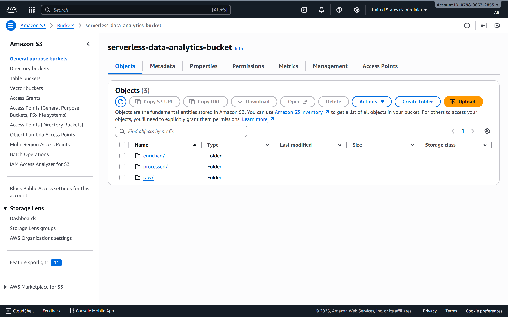
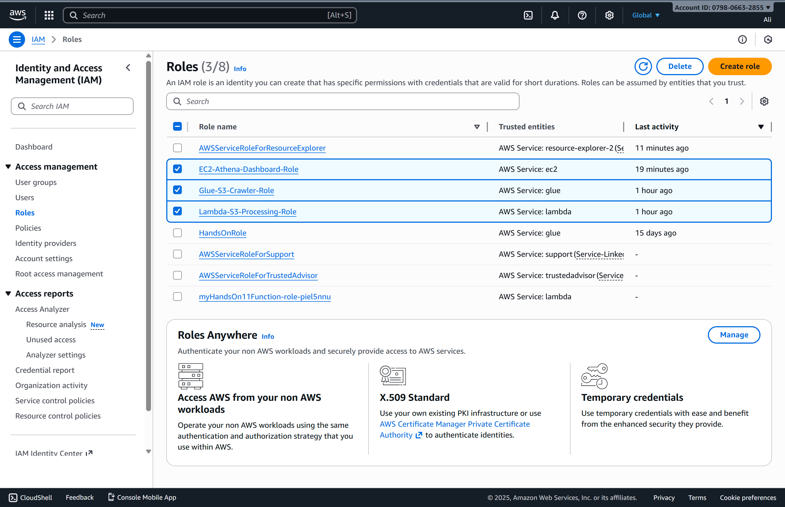
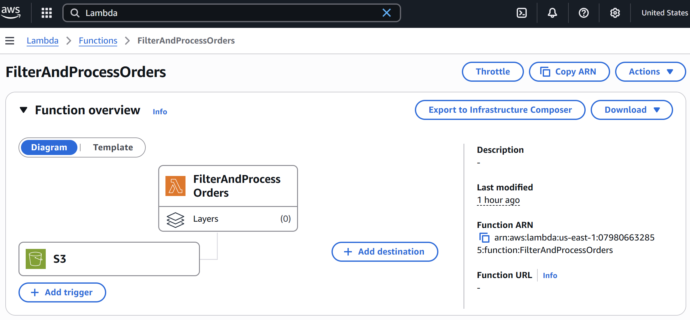
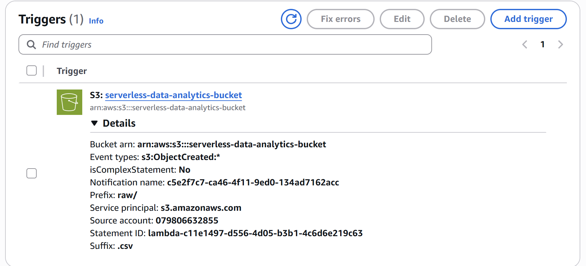
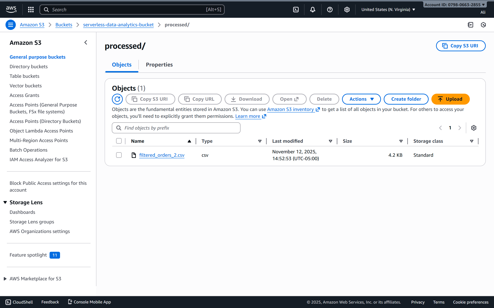
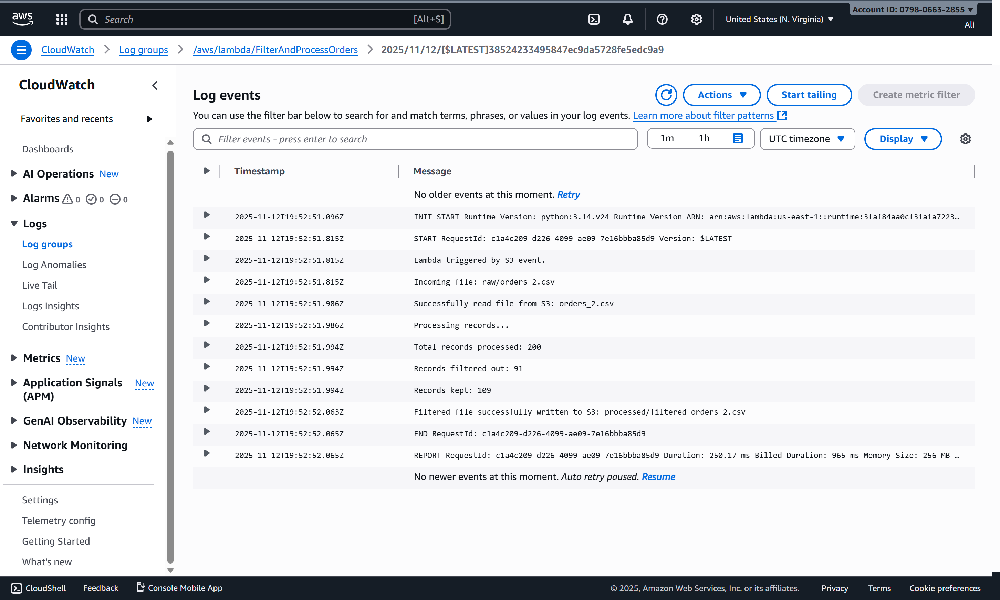
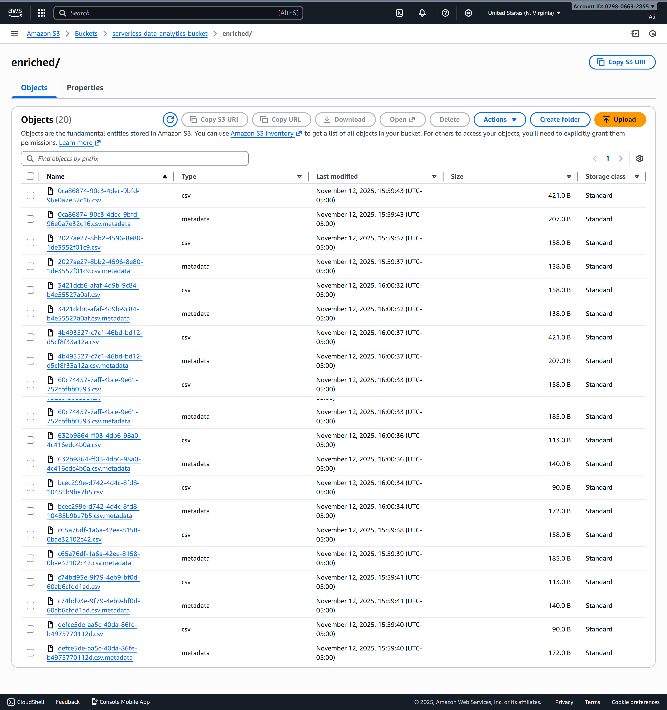
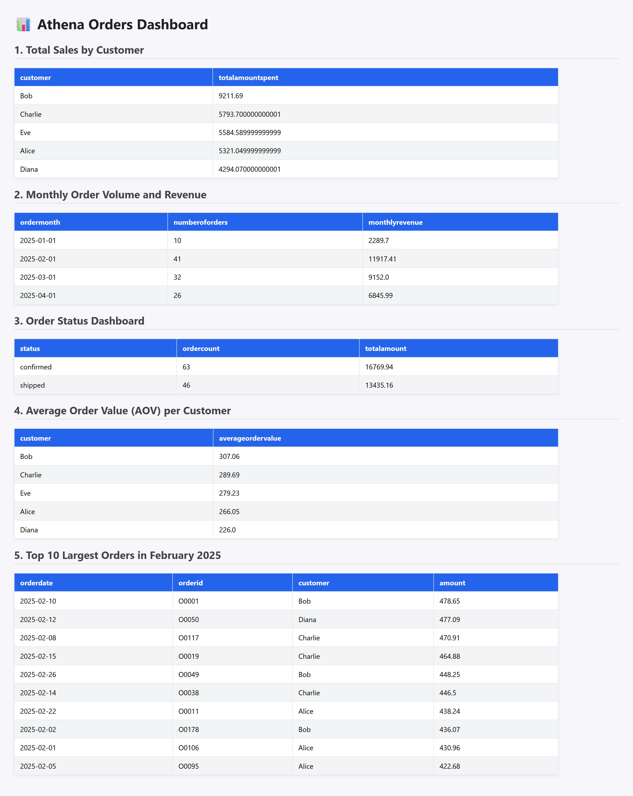

# ITCS-6190 Assignment 3: AWS Data Processing Pipeline (Complete Submission)

This project demonstrates an end-to-end **serverless** data processing pipeline on AWS. The workflow ingests raw data into S3, processes it with a Lambda function, catalogs it with AWS Glue, queries it with Amazon Athena, and displays the results on a simple Flask webpage hosted on an EC2 instance.

> **Your setup (filled in):**
> - **Bucket:** `serverless-data-analytics-bucket`
> - **Region:** `us-east-1`
> - **Glue Database:** `orders_db`
> - **Lambda Function:** `FilterAndProcessOrders`
> - **IAM Roles:** `Lambda-S3-Processing-Role`, `Glue-S3-Crawler-Role`, `EC2-Athena-Dashboard-Role`
> - **EC2 Web URL:** `http://13.223.188.161:5000`
> - **Athena results S3 path:** `s3://serverless-data-analytics-bucket/enriched/`
> - **Processed S3 prefix:** `s3://serverless-data-analytics-bucket/processed/`

---

## 1) Amazon S3 Bucket Structure 🪣

Create a bucket and three prefixes to organize data:
- `raw/` — incoming raw files
- `processed/` — Lambda output (filtered/cleaned CSVs)
- `enriched/` — Athena query result CSVs

**Screenshot:**  
  
*Figure: `serverless-data-analytics-bucket` root with `raw/`, `processed/`, `enriched/`.*

Upload `orders.csv` to `raw/`:
```bash
aws s3 cp orders.csv s3://serverless-data-analytics-bucket/raw/orders.csv
```

---

## 2) IAM Roles and Permissions 🔐

Create three roles with managed policies:

### 2.1 Lambda Execution Role
- **Role:** `Lambda-S3-Processing-Role`
- **Policies:** `AWSLambdaBasicExecutionRole`, `AmazonS3FullAccess`

### 2.2 Glue Service Role
- **Role:** `Glue-S3-Crawler-Role`
- **Policies:** `AmazonS3FullAccess`, `AWSGlueConsoleFullAccess`, `AWSGlueServiceRole`

### 2.3 EC2 Instance Profile
- **Role:** `EC2-Athena-Dashboard-Role`
- **Policies:** `AmazonS3FullAccess`, `AmazonAthenaFullAccess`

**Screenshot:**  
  
*Figure: Roles list highlighting the three roles above.*

---

## 3) Lambda Function ⚙️

Create a Lambda function that filters orders (drops `pending`/`cancelled` older than 30 days) and writes to `processed/`.

- **Function:** `FilterAndProcessOrders`
- **Runtime:** Python 3.11 (or 3.9/3.10)
- **Role:** `Lambda-S3-Processing-Role`

Replace the default code with the contents of `LambdaFunction.py` from the repo.

**Screenshot:**  
  
*Figure: Lambda overview page showing function name and runtime.*

### 3.1 Configure S3 Trigger
- **Bucket:** `serverless-data-analytics-bucket`
- **Event type:** `All object create events`
- **Prefix:** `raw/`
- **Suffix:** `.csv`

**Screenshot:**  
  
*Figure: Trigger panel showing S3 event on `raw/*.csv`.*

### 3.2 Verify Processing
Upload a new raw file (e.g., `orders_2.csv`) to trigger Lambda. Confirm the output file in `processed/` with prefix `filtered_...csv`.

**Screenshot:**  
  
*Figure: `processed/` with filtered CSV.*

---

## 4) AWS Glue Crawler 🕸️

Create a database and crawler to catalog the processed data:

- **Database:** `orders_db`
- **Crawler:** `orders_processed_crawler`
- **Data source:** `s3://serverless-data-analytics-bucket/processed/`
- **Role:** `Glue-S3-Crawler-Role`
- **Target database:** `orders_db`

Run the crawler and verify a table appears in `orders_db` (columns for `orderid`, `customer`, `amount`, `status`, `orderdate`).

**Screenshot:**  
  
*Figure: Glue crawler CloudWatch logs showing a successful run.*

---

## 5) Query Data with Athena 🔍

In **Athena (Trino)**:
- **Data source:** `AwsDataCatalog`
- **Database:** `orders_db`
- **Results location:** `s3://serverless-data-analytics-bucket/enriched/`

### 5.1 Create a Clean View
Replace `<TABLE_NAME>` with your Glue table name if needed, but this view assumes you’re already in `orders_db`:
```sql
CREATE OR REPLACE VIEW orders_db.filtered_orders AS
SELECT
  CAST(orderid   AS VARCHAR)             AS orderid,
  CAST(customer  AS VARCHAR)             AS customer,
  CAST(amount    AS DOUBLE)              AS amount,
  LOWER(CAST(status AS VARCHAR))         AS status,
  CAST(orderdate AS DATE)                AS orderdate
FROM orders_db."<TABLE_NAME>";
```

### 5.2 Assignment Queries (produce CSVs in `enriched/`)
1) **Total Sales by Customer**
```sql
SELECT customer, SUM(amount) AS totalamountspent
FROM orders_db.filtered_orders
GROUP BY customer
ORDER BY totalamountspent DESC;
```

2) **Monthly Order Volume and Revenue**
```sql
SELECT date_trunc('month', orderdate) AS ordermonth,
       COUNT(orderid)                 AS numberoforders,
       ROUND(SUM(amount), 2)          AS monthlyrevenue
FROM orders_db.filtered_orders
GROUP BY 1
ORDER BY ordermonth;
```

3) **Order Status Dashboard**
```sql
SELECT status,
       COUNT(orderid)       AS ordercount,
       ROUND(SUM(amount),2) AS totalamount
FROM orders_db.filtered_orders
GROUP BY status;
```

4) **Average Order Value (AOV) per Customer**
```sql
SELECT customer, ROUND(AVG(amount), 2) AS averageordervalue
FROM orders_db.filtered_orders
GROUP BY customer
ORDER BY averageordervalue DESC;
```

5) **Top 10 Largest Orders in February 2025**
```sql
SELECT orderdate, orderid, customer, amount
FROM orders_db.filtered_orders
WHERE orderdate BETWEEN DATE '2025-02-01' AND DATE '2025-02-28'
ORDER BY amount DESC
LIMIT 10;
```

**Screenshot:**  
  
*Figure: `enriched/` with Athena result CSVs.*

---

## 6) EC2 Web Server 🖥️

Launch an **Amazon Linux 2023** `t2.micro` with security group rules:
- **SSH** — `22` from **My IP**
- **Custom TCP** — `5000` from **0.0.0.0/0**
- Attach IAM profile **`EC2-Athena-Dashboard-Role`**

SSH into EC2, install deps, and run the Flask app:
```bash
# on EC2
sudo yum update -y
sudo yum install -y python3-pip
pip3 install Flask boto3

# create app.py and paste your Flask code
nano app.py  # set AWS_REGION="us-east-1", ATHENA_DATABASE="orders_db", S3_OUTPUT_LOCATION="s3://serverless-data-analytics-bucket/enriched/"
python3 app.py  # runs on 0.0.0.0:5000
```

Open the dashboard at: **`http://13.223.188.161:5000`**.

**Screenshot:**  
  
*Figure: Dashboard page with tables for the five queries.*

---

## Submission Checklist ✅

- [ ] **S3 structure** screenshot at bucket root showing `raw/`, `processed/`, `enriched/`  
  `screenshots/01-s3-structure.png`
- [ ] **IAM roles** screenshot  
  `screenshots/02-iam-roles.png`
- [ ] **Lambda overview** screenshot  
  `screenshots/03-lambda-overview.png`
- [ ] **Lambda trigger** screenshot  
  `screenshots/04-lambda-trigger.png`
- [ ] **Processed CSV** in `processed/` screenshot  
  `screenshots/05-processed-folder.png`
- [ ] **Glue crawler CloudWatch logs** screenshot  
  `screenshots/06-glue-crawler-cloudwatch.png`
- [ ] **Athena CSVs** in `enriched/` screenshot  
  `screenshots/07-athena-enriched.png`
- [ ] **Final webpage** running on EC2 screenshot  
  `screenshots/08-final-webpage.png`

---

## Notes & Troubleshooting 🧩

- **Lambda didn’t trigger?** Ensure the S3 trigger exists, correct bucket, `Prefix=raw/`, `Suffix=.csv`.
- **No processed file?** Upload a *new* object to `raw/` (events don’t retro-trigger). Check CloudWatch logs.
- **Crawler failed?** Confirm role `Glue-S3-Crawler-Role` and that `processed/` has CSV with headers.
- **Athena errors?** Verify `orders_db`, the table name, and that the `filtered_orders` view exists. Ensure results S3 path is set to `enriched/`.
- **EC2 5000 not reachable?** Security group rule for TCP 5000 must be open to `0.0.0.0/0`. The app must run on `0.0.0.0`.

---

## Repo Structure

```
aws-serverless-data-analytics-pipeline/
├─ LambdaFunction.py
├─ EC2InstanceNANOapp..py
├─ orders.csv
├─ README.md   ← (this file)
└─ screenshots/
   ├─ 01-s3-structure.png
   ├─ 02-iam-roles.png
   ├─ 03-lambda-overview.png
   ├─ 04-lambda-trigger.png
   ├─ 05-processed-folder.png
   ├─ 06-glue-crawler-cloudwatch.png
   ├─ 07-athena-enriched.png
   └─ 08-final-webpage.png
```

> Place your screenshots into the `screenshots/` folder with the exact filenames above so the images render on GitHub.
